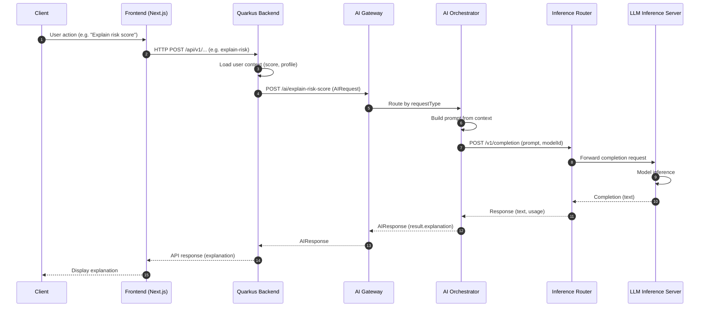
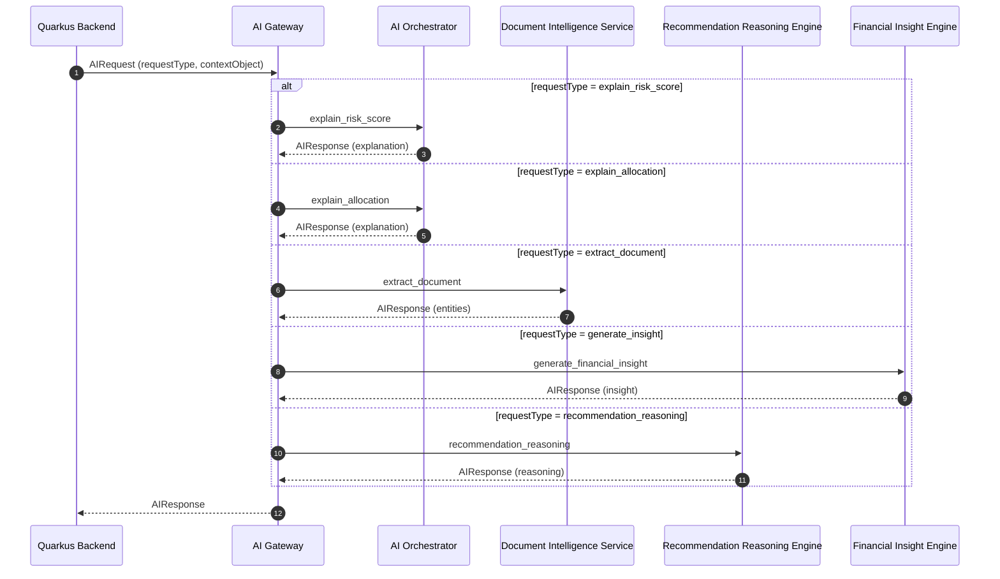
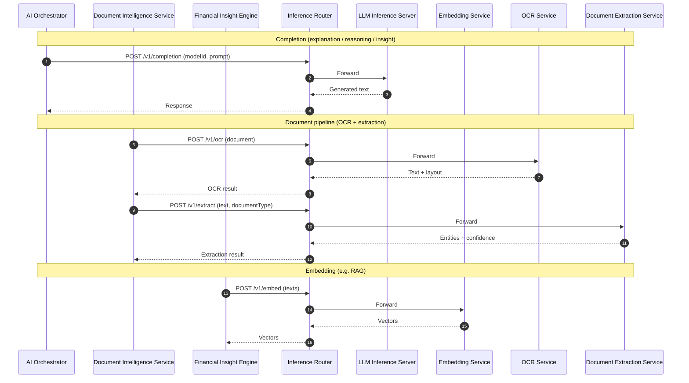

# Multiplus AI Platform — Core Architecture Diagrams

**Purpose:** High-level sequence diagrams for the AI platform. Components and flows are defined in earlier documentation (AI Integration Architecture, AI Gateway API Contract, Model Serving Architecture).

**Format:** Mermaid sequence diagrams. Render in any Markdown viewer that supports Mermaid (e.g. GitHub, GitLab, VS Code with Mermaid extension).

---

## 1. Platform → AI Integration Flow

Shows how an AI request (e.g. "Explain my risk score") travels from the client through the frontend, Quarkus backend, AI Gateway, AI Orchestrator, and Model Serving.

---

## 2. AI Gateway Routing Flow

Shows how the AI Gateway routes requests to the correct AI service based on `requestType`. Each service may call Model Serving internally (not expanded here).

---

## 3. AI Service → Model Serving Flow

Shows how AI services call the Inference Router, which forwards to the appropriate model server (LLM, Embedding, OCR, Document Extraction). Multiple service types are illustrated in parallel for clarity.

---

*Diagrams only. No other files modified. Render in a Mermaid-capable viewer.*
