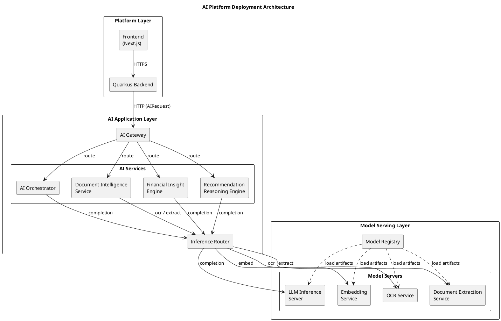
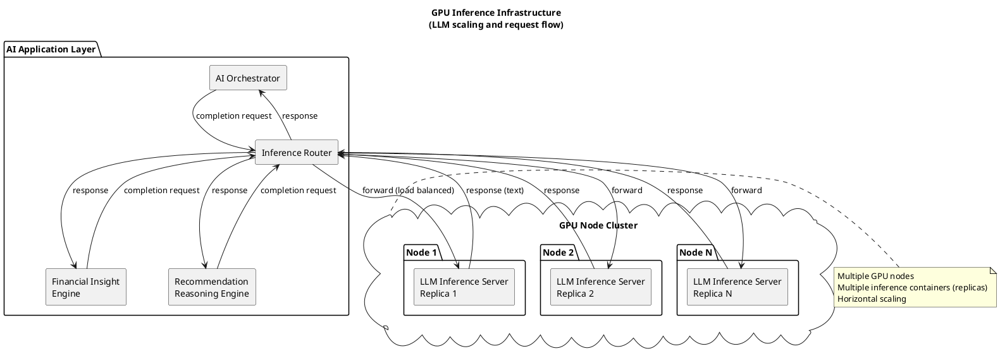
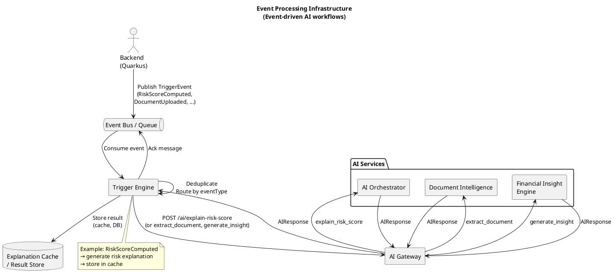
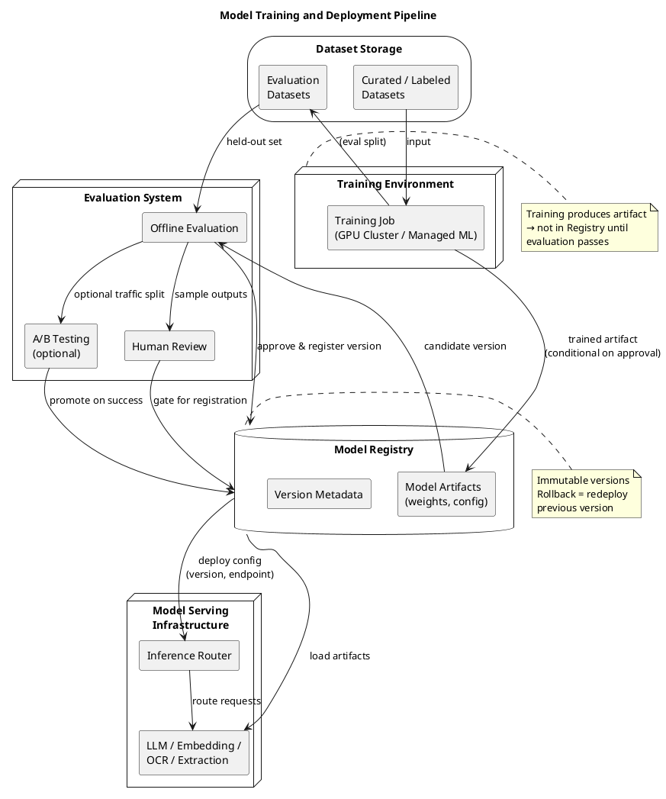

# Multiplus AI Platform — Infrastructure Architecture Diagrams (PlantUML)

**Purpose:** PlantUML component and deployment diagrams for the AI platform infrastructure: deployment layout, GPU inference, event processing, and model training/deployment pipeline.

**Format:** PlantUML. Copy each block to a `.puml` file and render with PlantUML (CLI, IDE, or server).

---

## 1. AI Platform Deployment Architecture

High-level deployment layout with logical layers: Platform Layer, AI Application Layer, Model Serving Layer.

---

## 2. GPU Inference Infrastructure

LLM inference on GPU nodes with multiple replicas and scaling. Inference requests from AI services through the router to GPU-backed LLM servers.

---

## 3. Event Processing Infrastructure

Event-driven AI: backend publishes to event bus, Trigger Engine consumes and runs AI workflows via AI Gateway.

---

## 4. Model Training and Deployment Pipeline

Model lifecycle: dataset → training → evaluation → registry → deployment to model serving.

---

*Infrastructure architecture diagrams only. PlantUML syntax. No other files modified. Render with PlantUML to produce PNG/SVG.*
