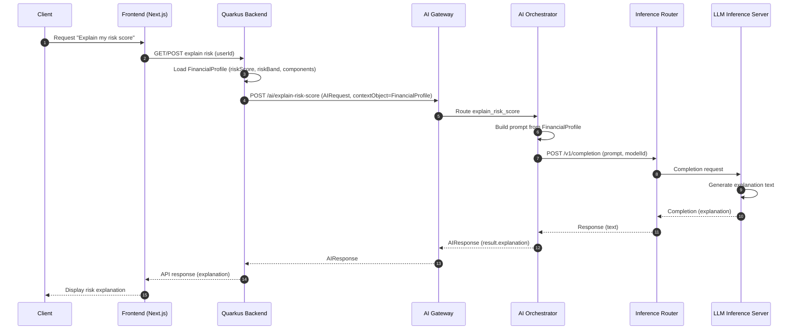
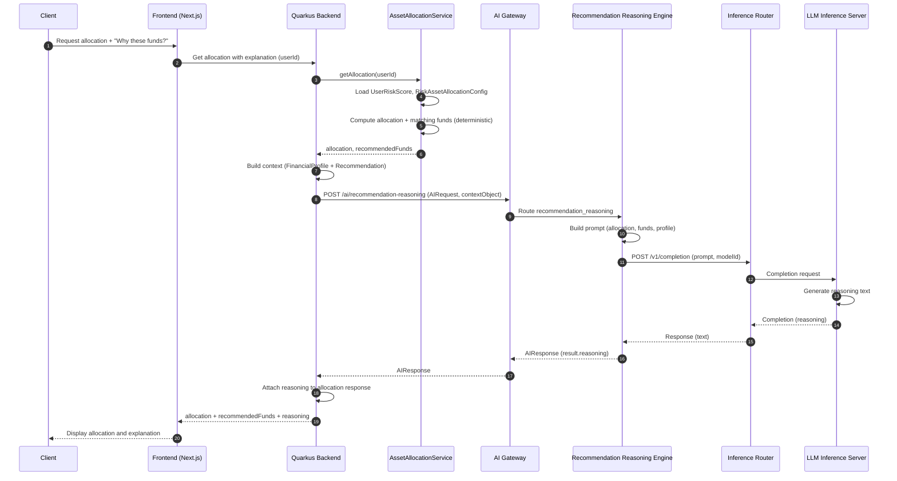
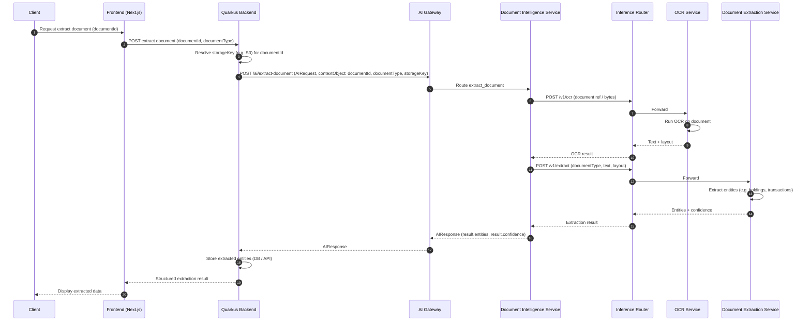
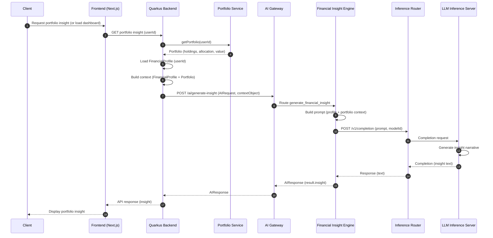
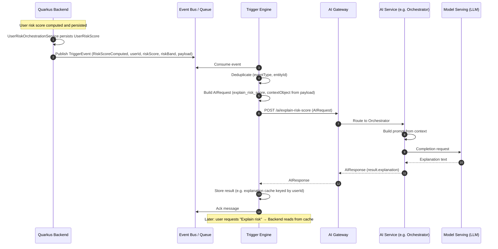

# Multiplus AI Platform — AI Workflow Diagrams

**Purpose:** Sequence diagrams for the main AI feature workflows. These show the step-by-step flow through frontend, backend, AI Gateway, AI services, and Model Serving. Infrastructure is described in earlier architecture docs.

**Format:** Mermaid sequence diagrams. Render in a Mermaid-capable Markdown viewer.

---

## 1. Risk Explanation Workflow

End-to-end flow when the user requests an explanation of their risk score. The backend loads the financial profile, sends an explain request to the AI Gateway, and the Orchestrator uses the LLM to generate the explanation.

---

## 2. Allocation Reasoning Workflow

The platform computes allocation and matching funds; AI only generates the reasoning text. Backend calls AssetAllocationService first, then sends the result to the AI Gateway for explanation.

---

## 3. Document Extraction Workflow

User has uploaded a document; the backend requests extraction. Document Intelligence runs OCR, then extraction, and returns structured entities.

---

## 4. Portfolio Insight Workflow

User requests a portfolio insight (or the UI loads the insight). Backend loads portfolio and profile, then the Financial Insight Engine generates narrative insight via the LLM.

---

## 5. Trigger Engine Workflow

Asynchronous flow: the backend publishes a domain event (e.g. RiskScoreComputed); the Trigger Engine consumes it, runs an AI workflow via the AI Gateway, and stores the result (e.g. cached explanation). No synchronous client request.

---

*Workflow diagrams only. No other files modified. Render in a Mermaid-capable viewer.*
