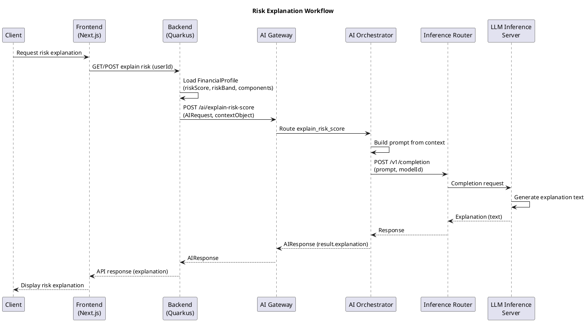
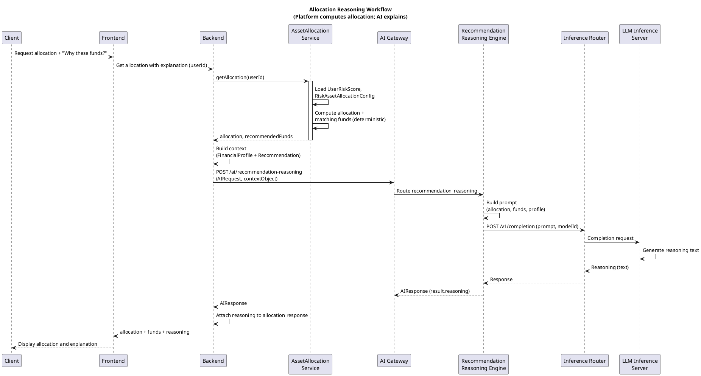
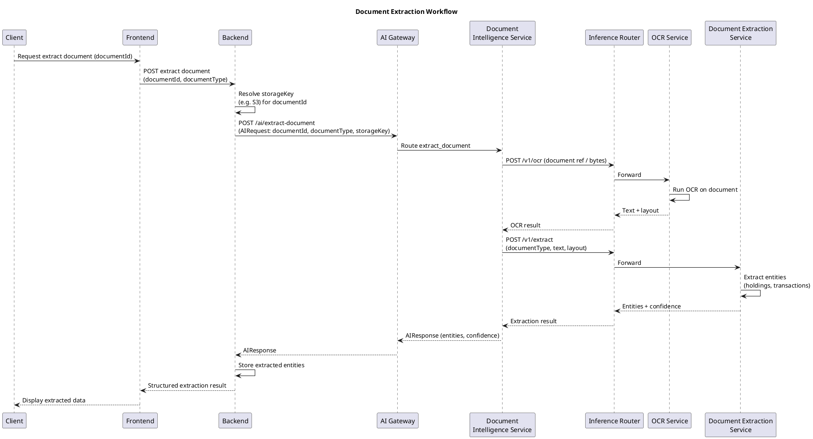
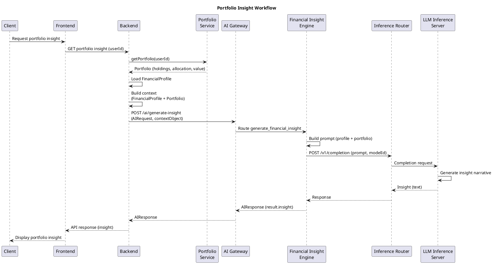
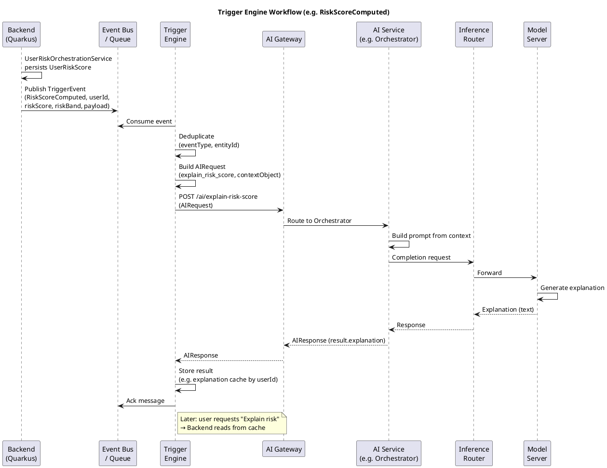

# Multiplus AI Platform — AI Workflow Diagrams (PlantUML)

**Purpose:** PlantUML sequence diagrams for the main AI feature workflows. Use with PlantUML (CLI, IDE plugin, or server) to generate PNG/SVG.

**Format:** PlantUML sequence diagram syntax. Copy each block to a `.puml` file or render in a PlantUML-capable viewer.

---

## 1. Risk Explanation Workflow

---

## 2. Allocation Reasoning Workflow

Allocation is computed by the platform; AI only explains it.

---

## 3. Document Extraction Workflow

---

## 4. Portfolio Insight Workflow

---

## 5. Trigger Engine Workflow

Example event: **RiskScoreComputed**. Backend publishes; Trigger Engine consumes, runs AI workflow, stores result.

---

*Workflow diagrams only. PlantUML syntax. No other files modified. Render with PlantUML to produce PNG/SVG.*
